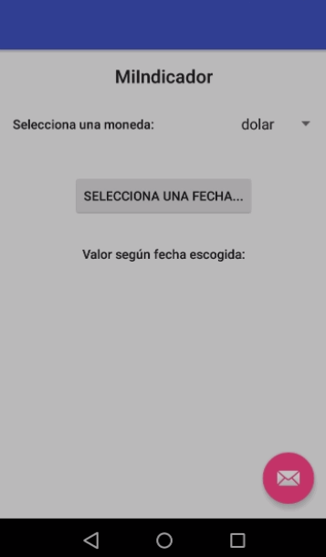

# MiIndicador

Repository corresponding to the challenge E10.

> What is MiIndicador?

This application allows users to check currencies for a specific day.

> What can you do in this application?

* Choose the currency you want to check (UF, UTM $Dolar, Euro, BTC).
* Choose the day you want to know the value of the currency.
* Currency value.

> What are the additional features?

* Use a Spinner to choose a currency.
* Use a DialogFragment to display a calendar.
* Use of [Retrofit2](https://square.github.io/retrofit/) and [Gson](https://github.com/square/retrofit/tree/master/retrofit-converters/gson) to consume and analyze data from the REST API of [MiIndicador](https://mindicador.cl/).

## Preview

## License

* [Apache 2.0](http://www.apache.org/licenses/LICENSE-2.0.html)
* [Maven](https://maven.apache.org/)

## Authors

* **Yerko Pailemilla Parada** - *Developer* - [yerkopailemilla](https://github.com/yerkopailemilla)

## Learnings achieved

* [Retrofit2](https://square.github.io/retrofit/)
* [Spinner](https://developer.android.com/guide/topics/ui/controls/spinner)
* [DatePicker](https://developer.android.com/reference/android/widget/DatePicker)

